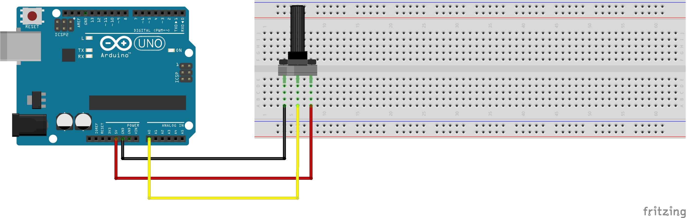

# 一体式模拟信号传感器数据采集分析系统

## 0 目的
采用Arduino直接或间接的读取岩土试验中常用模拟传感器（拉压传感器、位移传感器）的信号，并通过串口发送至树莓派。在树莓派上进行实时分析和交互式数据可视化，以达到在现场条件下快速分析试验结果的目的。

## 1 技术路线
- 了解Arduino和Raspberry Pi的背景和一些应用实例
- 进行Arduino读取模拟值的基础尝试--电位器实验
- 进行Arduino读取称重传感器的尝试--电子秤实验
- 采用常规放大电路和ADC使用Arduino读取位移传感器的RAW AD值
- 采用常规放大电路和ADC使用Arduino读取拉压传感器的RAW AD值
- 实现单个Arduino同时读取多路传感器
- 实现Arduino和Raspberry Pi通信
- 实现Raspberry Pi上的交互界面
- 功能完善，丰富Features
- 待续

## 2 实现过程

### 2.1 Arduino，Raspberry Pi背景和应用实例

### 2.2 电位器实验

