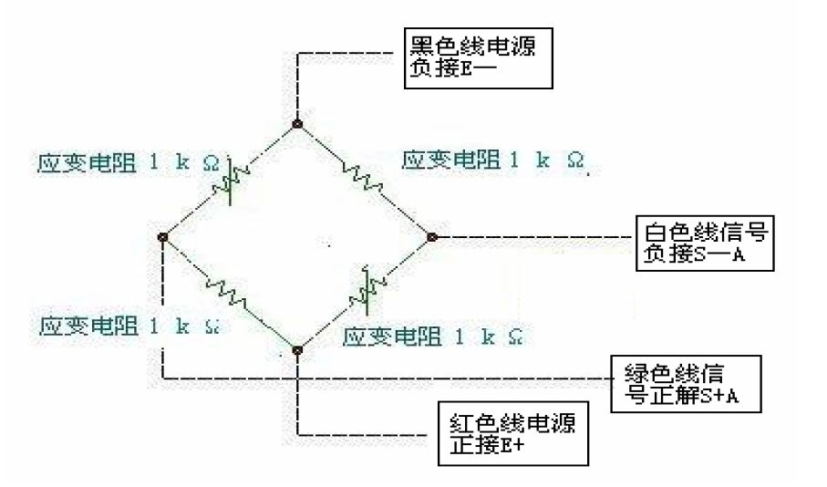
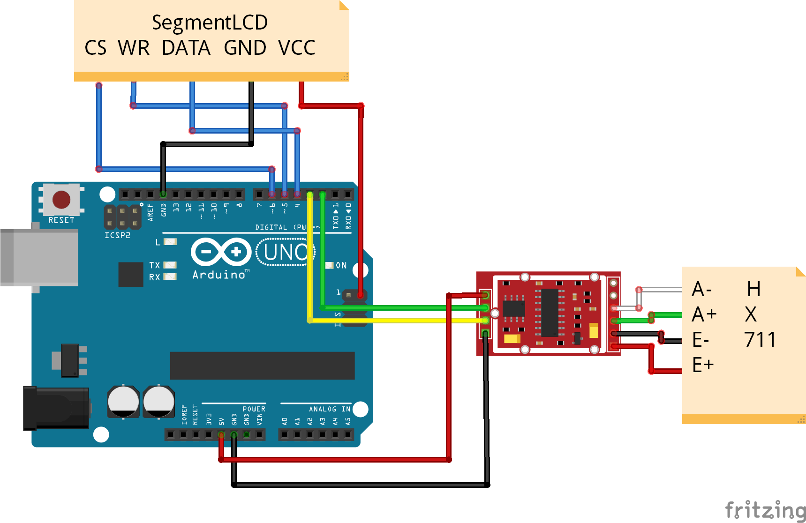

# 一体式模拟信号传感器数据采集分析系统

## 0 目的
采用Arduino直接或间接的读取岩土试验中常用模拟传感器（拉压传感器、位移传感器）的信号，并通过串口发送至树莓派。在树莓派上进行实时分析和交互式数据可视化，以达到在现场条件下快速分析试验结果的目的。

## 1 技术路线
- **了解Arduino和Raspberry Pi的背景和一些应用实例**
- **进行Arduino读取模拟值的基础尝试--电位器实验**
- **进行Arduino读取称重传感器的尝试--电子秤实验**
- **采用常规放大电路和ADC使用Arduino读取位移传感器的RAW AD值**
- **采用常规放大电路和ADC使用Arduino读取拉压传感器的RAW AD值**
- **实现单个Arduino同时读取多路传感器**
- **实现Arduino和Raspberry Pi通信**
- **实现Raspberry Pi上的交互界面**
- **功能完善，丰富Features**
- **待续**

## 2 实现

### 2.1 Arduino，Raspberry Pi背景和应用实例

### 2.2 电位器实验

Arduino自带10bit精度的ADC，无放大模块。对于一般的模拟信号传感器比如经典的电位器和一些小型的称重传感器，可以直接通过Analog In接口读取信号，根据传感器不同，进行线性或者非线性标定后即可使用。

本采用10K阻值的旋转电位器进行实验，代码示例在[project_pot](https://github.com/siyuanxu/arduino_analog_sensor/blob/master/project_pot/project_pot.ino)，下图为接线示意图。可以通过串口读出从0~1024变化的AD值，经过换算即可得到电位器的实时压值和阻值，也可以扩展应用到电控方向。

在取得了RAW AD值后，可以通过串口进行数据输出至上位机，这里采用Python的matplotlib进行数据实时绘制[示例代码](https://github.com/siyuanxu/arduino_analog_sensor/blob/master/project_pot/plot_analog_value.py)。不过这里是通过交互模式下循环绘图实现的实时可视化，在绘制效率上不太理想，在监测时间超过400s之后，会出现比较大的延迟，而且这个延迟随着绘图更新频率的增加而增大。

**TODO：寻找实时绘图效率高的交互式数据可视化方法**

### 2.3 电子秤实验

对于初学Arduino的爱好者，很多人会选择电子秤实验作为入门项目。经过查看资料了解到，电子秤中的称重传感器和岩土试验中的许多模拟信号传感器类型相似，都是惠斯通电桥传感器，所以这里也采用电子秤实验来熟悉Arduino采集电桥模拟信号的原理和方法。

由于Arduino自带的ADC只有10bit精度，很难满足精准称重的要求，所以这里采用了hx711模数转换芯片作为ADC。同时，为了对称重数据进行实时显示，增加了一块六位数显LCD来显示重量。为了使用这两个额外设备，需要在编译时引用[HX711.h](https://github.com/siyuanxu/arduino_analog_sensor/blob/master/HX711_5Kg/HX711.h)以及[SegmentLCD.h](https://github.com/siyuanxu/arduino_analog_sensor/blob/master/HX711_5Kg/SegmentLCD.h)两个库，当然为了顺利编译，也需要在路径中包含[HX711.cpp](https://github.com/siyuanxu/arduino_analog_sensor/blob/master/HX711_5Kg/HX711.cpp)以及[SegmentLCD.cpp](https://github.com/siyuanxu/arduino_analog_sensor/blob/master/HX711_5Kg/SegmentLCD.cpp)两个文件。 传感器电桥原理图和试验接线图如下。

由于电子秤项目教程丰富，整个系统也可以找到现成的套件。所以该实验并没有遇到什么问题。